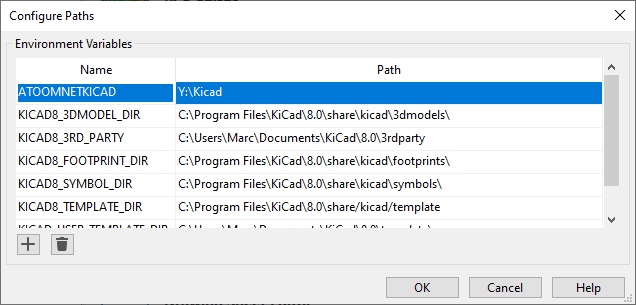

This repository contains my personal collection of Kicad symbols, footprints and 3d models I use in my Kicad projects.

Please note that not all symbols, footprints or 3d models have been been validated and/or production tested and should be assumed to be wildly incorrect. When you choose to use this library for any reason, please validate everything yourself.

Please configure your [Kicad Paths](https://docs.kicad.org/5.0/en/kicad/kicad.html#paths_configuration) and add ```${ATOOMNETKICAD}``` to point to the directory this repository has been cloned to.



The symbol and footprint libraries are loosely named and categorized like the Kicad Library itself, but that could change in a backwards incompatible way in a future update.

Symbol and footprint libraries are suffixed with '-fixed' when they contain a duplicate of an existing symbol or footprint and are only slightly altered, such as setting the path to the correct 3d-model.\
When suffixed with -extra the library contains not included (at some time) in the Kicad Library.

Note on 3d models: not all referenced models are included because of licensing conflicts preventing the model to be included in this repository. Some links are provided to places you can download the models yourself.

# License

This repositiry is licensed under the same conditions as the [original Kicad Library License](https://gitlab.com/kicad/libraries/kicad-footprints/-/blob/master/LICENSE.md).

A [copy of the license](LICENSE.md) has been included.